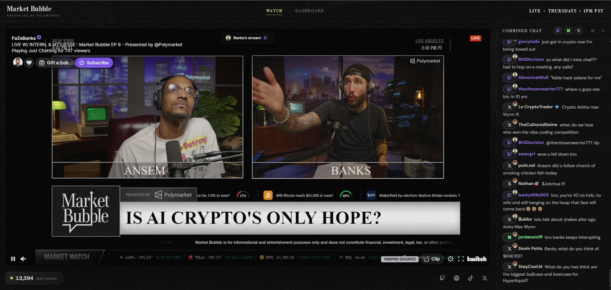
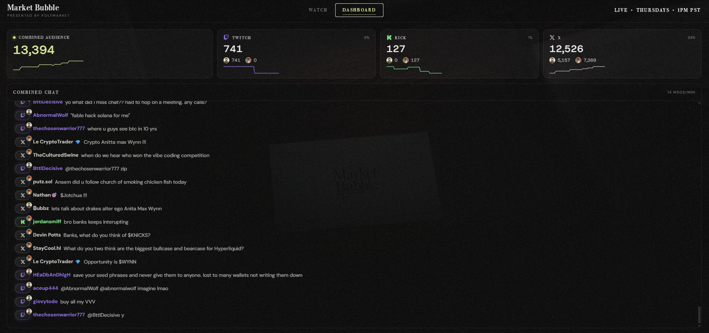
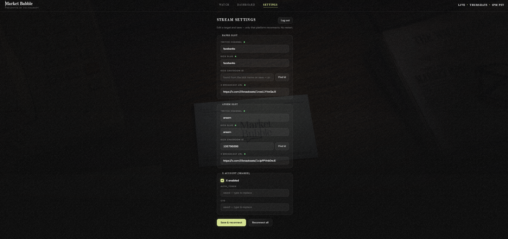
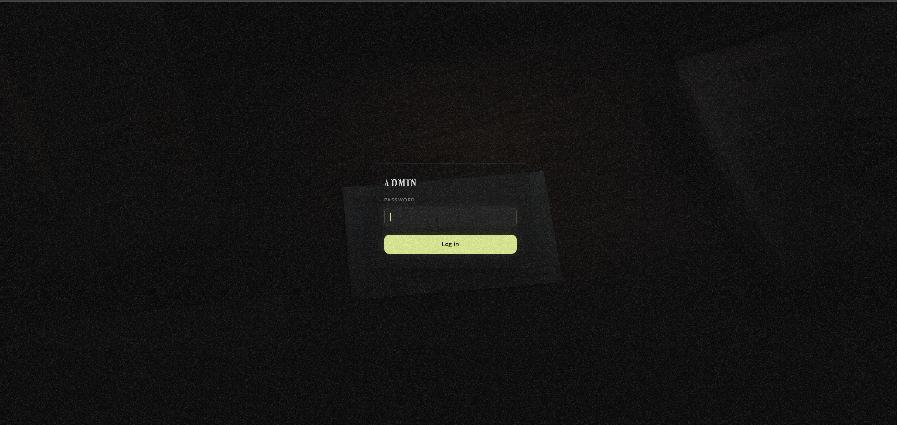

# Market Bubble Live — Unified Chat Aggregator

Built for the **Market Bubble $10,000 Vibe Code Challenge**: *"Unified chat aggregator — Twitch + X + Kick in one real-time feed with source labels."*

**🎥 Video demo:** [Watch on YouTube](https://www.youtube.com/watch?v=NJ-t8E1PmiU)

[](https://www.youtube.com/watch?v=NJ-t8E1PmiU)

## What it is

A live dashboard for **marketbubble.com** that merges the chats of **Banks** and **Ansem** across **Twitch, Kick, and X** (six channels) into one real-time feed with source labels, shows a combined viewer count with a per-channel breakdown, lets viewers watch either host's stream beside the merged chat, and gives the owners a Dashboard view of the whole audience. The feed is **read-only** — to chat, viewers post in the host's Twitch/Kick/X channel directly.

This is a production implementation of the design handoff in [`design-reference/`](./design-reference) — the prototype's client-side simulation (`chat-sim.js`) has been replaced with a real aggregation server.

## Screenshots

### Watch tab
Both hosts' streams side by side with the merged Twitch + Kick + X chat — every message tagged with its source platform.



### Dashboard tab
Combined audience count with live per-platform breakdown (Twitch / Kick / X sparklines and per-host viewer counts) above the full-width merged chat.



### Stream Settings tab
Owner-only runtime configuration: change each host's Twitch channel, Kick slug, and X broadcast without restarting the server.



### Admin login
Password gate protecting the Settings page in production.



## How it works

```
[Twitch IRC]──┐                              ┌─→ /ws ─→ browsers (snapshot + live deltas)
[Kick Pusher]─┼─→ AggregatorHub (ring buffer,│
[X broadcast]─┤   viewer matrix, status,     ├─→ SPA (Vite dev / dist) + /api/config
[viewer polls]┘   live flag)                ─┘
```

One Node process serves the React SPA (Vite middleware in dev, prebuilt `dist/` in prod), the `/ws` WebSocket, and the aggregation engine together (`server/index.ts`). Adapters read each platform's chat and fan into a hub; the hub broadcasts one merged stream to all browsers. The client buffers incoming messages and renders in ~100ms batches, so the UI stays smooth even when the merged feed runs at 100+ msgs/s. When the show ends (every channel stays offline for ~2 minutes — a grace period so a mid-show stream hiccup doesn't count), the hub wipes the merged chat everywhere, so the finished show's messages don't linger under the offline countdown. The app never posts to any platform.

| Platform | Read chat | Viewer counts |
|---|---|---|
| **Twitch** | ✅ anonymous IRC (no keys) | ✅ Helix (needs app keys) |
| **Kick** | ✅ Pusher websocket (unofficial) | ✅ official API (keys) / web fallback |
| **X** | ⚠️ experimental, owner-only, off by default | ⚠️ only when enabled |

> **X note:** X has no public API for live-broadcast chat. Reading is an opt-in, owner-only experiment (you supply your own session cookies and the live broadcast id) that fails soft to "unavailable" and never affects the rest of the app.

## Quick start (no keys needed)

```bash
npm install
npm run dev:sim     # synthetic traffic through the real pipeline
```

Open http://localhost:3000. The simulator feeds the full client/WebSocket path so you can see every screen working without any credentials. Useful flags (set in `.env.local` or inline):

- `SIM_BROADCAST=offline` — show the offline hero + live countdown
- `SIM_FLAP=1` — randomly flap a source to "reconnecting" (amber dots)
- `SIM_RATE=200` — messages per minute

## Real mode

```bash
cp .env.example .env.local
# fill in any platform keys you have
npm run dev
```

Everything degrades gracefully: a platform with no keys simply shows as "unavailable" and its viewer cells render `—`. Twitch chat reading needs **no** keys at all.

### 1. Twitch app (viewer counts)

1. Go to https://dev.twitch.tv/console/apps → **Register Your Application**.
2. Category: *Website Integration*. Create it, then copy the **Client ID** and generate a **Client Secret**.
3. Put them in `TWITCH_CLIENT_ID` / `TWITCH_CLIENT_SECRET`.

Twitch *chat reading* works without this; the app token is only used for viewer counts / live detection.

### 2. Kick app (viewer counts)

1. Go to https://kick.com/settings/developer → create an application.
2. Copy the **Client ID** / **Client Secret** into `KICK_CLIENT_ID` / `KICK_CLIENT_SECRET`.

Kick *chat reading* uses the unofficial Pusher feed (no keys). If Kick's Cloudflare blocks server-side channel lookups (you'll see `resolve … failed HTTP 403` in the logs), paste the chatroom ids directly:

```ini
KICK_CHATROOM_ID_BANKS=669512      # from https://kick.com/api/v2/channels/<slug> → chatroom.id
KICK_CHATROOM_ID_ANSEM=...
```

### 3. Channels

Defaults are the show's channels. Point them at **any currently-live channels** to test off-air:

```ini
TWITCH_CHANNEL_BANKS=fazebanks
TWITCH_CHANNEL_ANSEM=ansem
KICK_SLUG_BANKS=fazebanks
KICK_SLUG_ANSEM=ansem
```

### 4. X experimental reader (optional, owner-only)

Off by default. To try it, set `X_ENABLED=1`, paste the **owner account's** `auth_token` and `ct0` cookies, and the live broadcast ids (from the `x.com/i/broadcasts/<id>` URL when live):

```ini
X_ENABLED=1
X_AUTH_TOKEN=...
X_CT0=...
X_BROADCAST_ID_BANKS=1abcXYZ...
```

Using your own session cookies may violate X's ToS — it's your informed choice. Never collect visitor X credentials.

## Admin gate & live stream settings

The **Settings** tab edits the stream targets at runtime — no restart needed:

- Per host: Twitch channel, Kick slug (+ optional chatroom id), X broadcast URL.
- Shared X account: enable toggle plus the `auth_token` / `ct0` cookies (write-only — the API never sends them back, only an "is set" flag).
- Saving reconnects **only the platforms that changed**; *Reconnect all* force-reconnects everything.
- Changes persist to `server/streams.local.json` (gitignored — it can hold the X cookies; path overridable with `STREAMS_CONFIG_PATH`) and take precedence over `.env.local` across restarts.

Access control:

- `ADMIN_PASSWORD` **unset** — Settings is open in local dev and **disabled entirely in production**.
- `ADMIN_PASSWORD` **set** — `/admin` shows a login gate for the Settings page and its APIs. The session is a signed cookie; set `SESSION_SECRET` to a long random value in production so logins survive restarts. The login endpoint is rate-limited.
- Behind a reverse proxy or PaaS, set `TRUST_PROXY=1` so the rate limiter reads the real client IP from `X-Forwarded-For` (leave it unset on a directly-exposed server).

## Scripts

| Script | What it does |
|---|---|
| `npm run dev` | Custom server + Vite dev middleware (HMR), real sources |
| `npm run dev:sim` | Same, with the synthetic simulator |
| `npm run build` | Production client build (`vite build` → `dist/`) |
| `npm run start` | Production server (`build` first) |
| `npm run typecheck` | App + server TypeScript checks |
| `npm run lint` | ESLint |

## Deployment

This app ships its own Node server. Deploy to any Node host (Railway, Fly, a VPS) with:

```bash
npm run build && npm run start
```

Set `ADMIN_PASSWORD` and `SESSION_SECRET` in the host's environment if you want the Settings page available in production (it is disabled otherwise), and `TRUST_PROXY=1` when running behind a proxy/PaaS.

Settings saved in the admin UI persist to a JSON file — `server/streams.local.json` by default, which is **ephemeral on most PaaS hosts** (Railway, Fly): every redeploy resets it and saved stream targets fall back to the env defaults. Mount a volume and set `STREAMS_CONFIG_PATH` to a file on it (e.g. `/data/streams.json`) to keep them across deploys.

Behind a reverse proxy, forward the `Upgrade` header so `/ws` works. The Twitch embed `parent` uses the request hostname automatically.

The aggregation hub lives in memory, so run a **single instance** (scale vertically). Walburn (the display font) is currently hotlinked from the Framer CDN — license and self-host it into `public/fonts/` before launch.

## Project structure

```
server/      custom server, hub, ws-gateway, runtime-config (admin-editable
             stream settings), adapters/ (twitch-irc, kick-pusher, x-broadcast,
             sim), pollers/, lib/ (admin-auth, tokens, http, log, …)
shared/      protocol.ts (ws message shapes) + meta.ts (brand constants)
src/         main.tsx (config fetch → render bootstrap), fonts.css,
             globals.css (design port + responsive/mobile pass); index.html at
             the root
components/  1:1 React port of the handoff UI + AdminLogin / SettingsView
hooks/       useAggregator (ws client), useCountdown
```
